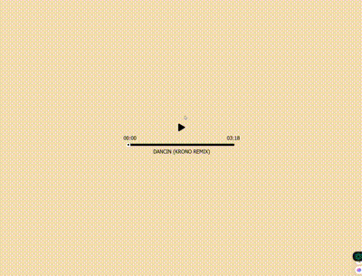

# 🎵 music player Engine 🎵

[See it in Action!!](https://daniyalalborz.github.io/music-player/)

This project provides a music player engine designed as a replacement for the default HTML audio controls.  With this player, you can dynamically play, pause, and control your music.

## Features

- 🏷️ User-friendly and modern design using CSS.
- 🎶 Easy play and pause functionality with simple buttons.
- 🔊 Compatible with modern browsers (with HTML5 support).
- ⏱️ Control over music playback time.

## Installation and Usage

1. Download the index.html file or copy its code into an HTML file.
2. Open the file in a web browser.
3. Use the provided buttons to start and stop music playback.

## Note

Before using, ensure that the desired music files are in an accessible location.

## Contributing

If you're interested in contributing to the development and improvement of this project, you can fork it and submit pull requests.

## License

This project is open-source, and you are free to use it in your own projects.
 
# 🎵 موزیک پلیر 🎵

این پروژه شامل یک موزیک پلیر است که با استفاده از HTML و CSS طراحی شده و جایگزینی برای کنترل‌های پیش‌فرض مرورگر برای پخش موسیقی می‌باشد. این پلیر به کاربر امکان می‌دهد که به صورت داینامیک موسیقی را کنترل کند.

## ویژگی‌ها

- 🏷️ طراحی ساده و شیک با استفاده از CSS
- 🎧 کنترل داینامیک پخش موزیک: امکان پخش، توقف، جلو و عقب بردن موزیک به صورت داینامیک.
- 🖌️ قابلیت طراحی رابط کاربری پلیر بر اساس سلیقه و نیازهای خود.
- 🔊 سازگار با تمام مرورگرهای مدرن که از HTML5 پشتیبانی می‌کنند
- ⏱️ زمان پخش موزیک رو کنترل کنید
- ⌛ پیاده‌سازی سریع و آسان در پروژه‌های وب.

## نصب و استفاده

1. ابتدا فایل index.html را دانلود کرده و یا کُد آن را در یک فایل HTML ذخیره کنید.
2. فایل index.html را در مرورگر خود باز کنید.
3. برای شروع پخش، بر روی دکمه‌های پخش/توقف کلیک کنید.

## توجه

قبل از استفاده، مطمئن شوید که فایل‌های موسیقی در مکان مناسبی برای دسترسی توسط کُد HTML قرار دارند.

## همکاری

از تمامی پیشنهادات و بهبودها استقبال می‌شود! می‌توانید با fork یا ارسال Pull Request در توسعه این پروژه مشارکت کنید.

## لایسنس

این پروژه تحت لایسنس MIT منتشر شده است. برای اطلاعات بیشتر به فایل [LICENSE](LICENSE) مراجعه کنید.
## مجوز

این پروژه به صورت اپن سورس ارائه شده است و می‌توانید از آن برای پروژه‌های خود استفاده کنید.
